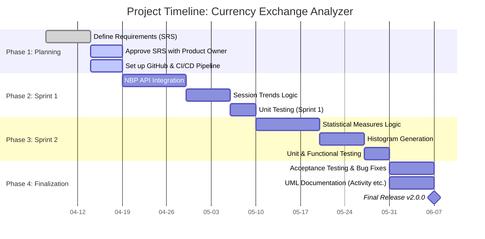

```mermaid
gantt
    title Project Timeline: Currency Exchange Analyzer
    dateFormat  YYYY-MM-DD
    axisFormat  %m-%d
    
    section Phase 1: Planning
    Define Requirements (SRS)       :done, req1, 2026-04-07, 7d
    Approve SRS with Product Owner  :active, req2, after req1, 5d
    Set up GitHub & CI/CD Pipeline  :active, req3, after req1, 5d

    section Phase 2: Sprint 1
    NBP API Integration             :dev1, after req2, 10d
    Session Trends Logic            :dev2, after dev1, 7d
    Unit Testing (Sprint 1)         :test1, after dev2, 4d

    section Phase 3: Sprint 2
    Statistical Measures Logic      :dev3, after test1, 10d
    Histogram Generation            :dev4, after dev3, 7d
    Unit & Functional Testing       :test2, after dev4, 4d

    section Phase 4: Finalization
    Acceptance Testing & Bug Fixes  :fin1, after test2, 7d
    UML Documentation (Activity etc.):fin2, after test2, 7d
    Final Release v2.0.0            :milestone, m1, after fin1, 0d
```
