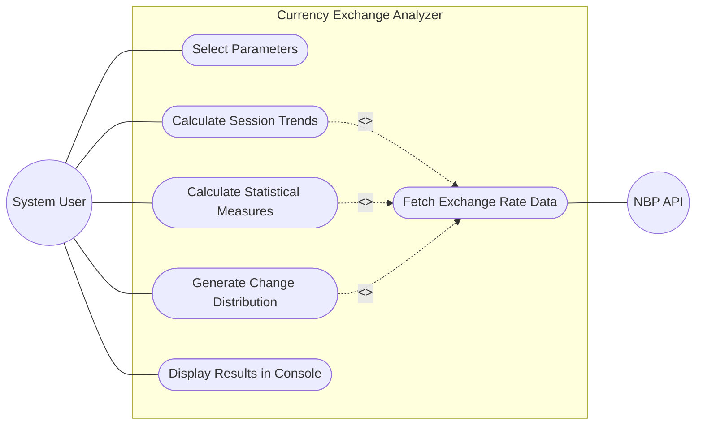

```mermaid
flowchart LR
    %% Aktorzy
    User((System User))
    API((NBP API))

    %% Granica systemu
    subgraph System [Currency Exchange Analyzer]
        direction TB
        UC1([Select Parameters])
        UC2([Calculate Session Trends])
        UC3([Calculate Statistical Measures])
        UC4([Generate Change Distribution])
        UC5([Fetch Exchange Rate Data])
        UC6([Display Results in Console])
    end

    %% Połączenia między aktorem a systemem
    User --- UC1
    User --- UC2
    User --- UC3
    User --- UC4
    User --- UC6

    %% Relacje typu include (muszą pobrać dane)
    UC2 -. "<<include>>" .-> UC5
    UC3 -. "<<include>>" .-> UC5
    UC4 -. "<<include>>" .-> UC5

    %% Zewnętrzne API
    UC5 --- API
```
